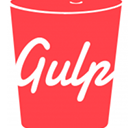

[](http://github.com/acidjazz/objectus)

[](http://coffeescript.org/)

[](https://pugjs.org/)

[](http://stylus-lang.com/)

[](http://gulpjs.com//)


# [SPA](https://en.wikipedia.org/wiki/Single-page_application) skeletal setup
> *Note*: currently in early development


## Usage

*  compile all javascript, css, and html
```bash
gulp
```

*  compile all vendor included libraries specified in `gulpfile.coffee` to `public/javascript/vendor.js` and `public/css/vendor.css`
```bash
gulp vendor
```

* compile all 3 but minified, uglified, and non-sourcemaped
```bash
gulp prod
```

* run browser-sync and host `public/` and all its related directories 
```bash
gulp sync
```
